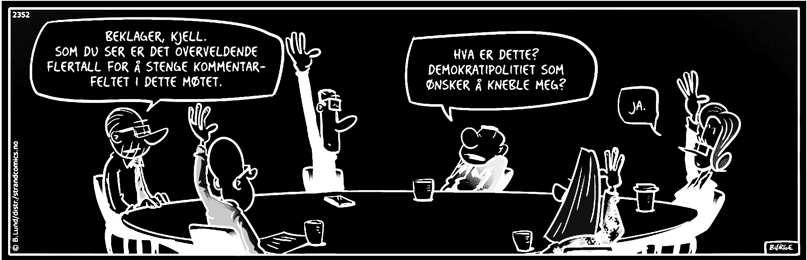

# MMM-Tegneserie
A module for MagicMirror<sup>2</sup> that displays comics from Dagbladet.no.

</img>

## Dependencies
  * A [MagicMirror<sup>2</sup>](https://github.com/MichMich/MagicMirror) installation
  * [cheerio](https://github.com/cheeriojs/cheerio) npm package

## Installation
  1. Clone this repo into your `modules` directory.
  2. Create an entry in your `config.js` file to tell this module where to display on screen.
  3. Run `npm install -p cheerio`
  
 **Example:**
```
 {
    module: 'MMM-Tegneserie',
	position: 'bottom_bar',
	config: {
		updateInterval : 36000000,
    showColor: false,
    comicTitle: 'lunch'
	}
 },
```

## Config
| **Option** | **Description** |
| --- | --- |
| `updateInterval` | Set to desired update interval (in ms), default is `18000000` (5 hours). |
| `showColor` | Boolean for displaying true colors instead of greyscale. Default is false |
| `comicTitle` | The desired comic to be displayed from dagbladet.no. Example: 'lunch', 'pondus', 'nemi'. Default is 'lunch' |

Heavily inspired by the MagicMirror plugin [DailyDilbert](https://github.com/andrecarlucci/MMM-DailyDilbert).
